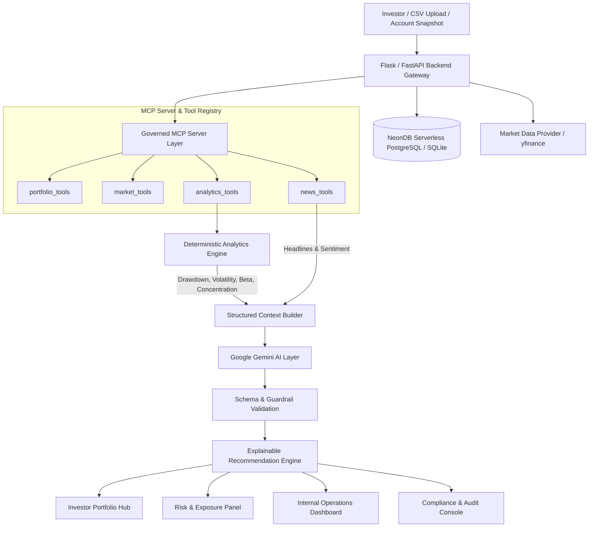

# Zerodha: AI Financial Intelligence Platform

> **Governed Portfolio Intelligence, MCP Unification & Explainable Recommendations Engine**
> 
> *A production-grade, audit-ready AI platform designed to convert raw holdings, live market signals, and news into explainable portfolio insights without uncontrolled trade-execution risk.*

---

## 1. Executive Summary & Problem Framing

Retail investors on modern brokerage platforms have immediate access to numbers, P&L, stock prices, and transaction histories. However, during volatile market conditions, they frequently lack the time, analytical context, or confidence to interpret:
- **Why** their portfolio gained or lost value today.
- **Where** unmanaged risks (e.g. >40% single-sector concentration, peak drawdowns) are compounding.
- **Which** specific holdings or corporate events drove portfolio movement.
- **What** safe, non-execution review actions they should consider next.

The **Zerodha AI Financial Intelligence Platform** bridges this gap. It implements a governed, deterministic intelligence pipeline:
$$\text{Portfolio Input} \longrightarrow \text{Market/Internal Fetch} \longrightarrow \text{MCP Tool Unification} \longrightarrow \text{Deterministic Analytics} \longrightarrow \text{LLM Reasoning (Gemini)} \longrightarrow \text{Explainable Recommendations}$$

---

## 2. Product Surfaces

The platform delivers 6 cohesive, production-ready product surfaces:

1. **Stocks & Market Benchmark Hub**: Live NIFTY 50, SENSEX, BANKNIFTY indices, interactive OHLC candlestick charts, and top bluechip gainers/losers.
2. **F&O & IPO Intelligence Console**: PCR ratios, Max Pain strikes, open interest buildup interpretation, and grey market premium (GMP) IPO tracking.
3. **Mutual Funds & ETF Analyzer**: Profile-aligned fund suggestions (Flexi-Cap, Mid-Cap, Hybrid, Debt) for balanced capital preservation.
4. **Investor Portfolio AI Hub**:
   - **Relative Performance Card**: Portfolio vs. Benchmark return alpha.
   - **Executive Summary**: Plain-language AI portfolio health overview.
   - **Risk & Exposure Panel**: Sector concentration alerts (>40%), historical maximum drawdown, and portfolio Beta.
   - **Market Movement Explainer**: Stock-level P&L contribution breakdown linked to recent corporate news.
   - **Explainable Recommendation Console**: 4 categorized recommendation cards (*Risk Attention, Diversification Review, Catalyst Monitoring, Rebalancing Follow-up*) with confidence scores, rationales, and regulatory disclaimers.
5. **Internal Operations & Health Dashboard**: Live monitoring for API latency (p50/p95), error rates, uptime, MCP tool distribution, feedback mix, and interactive MCP tool testing.
6. **Compliance & Regulatory Audit Console**: Cryptographic SHA-256 prompt hashing, model version traceability, SEBI non-advice verification, and formal compliance officer sign-offs.

---

## 3. System Architecture & Tech Stack



### Technology Matrix

| Component | Technology | Role & Purpose |
|---|---|---|
| **Frontend** | React 18 (Vite), Tailwind CSS, Lucide Icons | Responsive investor hub, charts, operations and compliance consoles |
| **Backend API** | Python (Flask / Flask-CORS / Flask-JWT) | REST API routing, JWT auth, database connectors, and audit trail |
| **MCP Integration** | Model Context Protocol (v2025-06-18) | Schema-bound tool access for portfolio, market, news, and risk analytics |
| **Analytics Engine** | Python (Pandas, NumPy) | Deterministic calculation of P&L, concentration, drawdown, volatility, beta |
| **LLM Reasoning** | Google Gemini 1.5/3.5 Flash (`@google/genai`) | Structured plain-language explanations and recommendation generation |
| **Database** | NeonDB PostgreSQL / SQLite Hybrid | User accounts, portfolio holdings JSONB, compliance logs, MCP execution stats |
| **Deployment** | Vercel (Frontend) & Render / Railway (Backend) | Cloud deployment with environment variable isolation |

---

## 4. Model Context Protocol (MCP) Server

The platform includes a dedicated, schema-bound **Model Context Protocol (MCP)** Server implementation (`mcp_server/`) conforming to protocol specification `v2025-06-18`.


### Governed Tool Registry

| Tool Name | Category | Primary Function | Return Output / Telemetry |
|---|---|---|---|
| **`lookup_portfolio`** | `portfolio` | Fetches normalized holdings snapshot, allocation weights & risk profile | NeonDB PostgreSQL JSONB / Local JSON fallback |
| **`validate_portfolio_completeness`** | `portfolio` | Pre-inference gate verifying required fields (shares, avg buy, current price) | Completeness score (0-100%) & validation report |
| **`fetch_market_quotes`** | `market` | Real-time LTP, % change, 52W High/Low and day ranges | Live `yfinance` fast-info quotes with cache fallback |
| **`fetch_historical_ohlc`** | `market` | Historical daily Open-High-Low-Close candle series & volume | Interactive candlestick chart time-series payload |
| **`fetch_ticker_sentiment_news`** | `news` | Symbol-specific news headlines with automated sentiment tagging | Recent headlines with POSITIVE/NEGATIVE/NEUTRAL tags |
| **`compute_portfolio_metrics`** | `analytics` | Deterministic mathematical calculation of P&L, contribution, beta, drawdown | Grounded factual analytics payload for LLM reasoning |
| **`calculate_risk_alerts`** | `analytics` | Prudential threshold rules (>40% sector concentration, >22% volatility) | Governed risk warnings and critical alert levels |

---

## 5. Local Setup & Quickstart

### Prerequisites
- Python 3.10+
- Node.js 18+ and npm

### Backend Setup
```bash
# 1. Clone repository
git clone https://github.com/Its-Vaibhav-2005/Zerodha-AI-Financial-Intelligence-Platform.git
cd Zerodha-AI-Financial-Intelligence-Platform

# 2. Configure environment
cp .env.example .env
# Fill in GEMINI_API_KEY and NEON_DATABASE_URL in .env

# 3. Install Python dependencies
pip install -r backend/requirements.txt

# 4. Start Flask backend server
python backend/app.py
# Backend runs at http://localhost:5000
```

### Frontend Setup
```bash
# 1. Navigate to frontend directory
cd frontend

# 2. Install dependencies
npm install

# 3. Start development server
npm run dev
# Frontend runs at http://localhost:5173
```

---

## 6. Automated Test Suite

Run the full automated test suite covering analytics, MCP server, AI schemas, and edge cases:

```bash
# Run all unit tests
python -m unittest discover tests

# Or run specific test modules
python -m unittest tests/test_analytics.py
python -m unittest tests/test_mcp_server.py
python -m unittest tests/test_ai_validation.py
python -m unittest tests/test_edge_cases.py
```

---

## 7. Submission Deliverables Checklist

- [x] **Complete GitHub Repository** with clear modular folder structure (`frontend/`, `backend/`, `mcp_server/`, `ai_workflows/`, `analytics/`, `docs/`, `tests/`, `deployment/`).
- [x] **Environment Template** (`.env.example`) with complete configuration parameters.
- [x] **Governed MCP Server** with schema-bound tool registry and live execution console.
- [x] **Deterministic Analytics Engine** calculating P&L contribution, concentration alerts, max drawdown, volatility, and benchmark Beta.
- [x] **AI Workflow & Explainable Recommendations** with 4 distinct card categories and strict non-execution guardrails.
- [x] **Internal Operations Dashboard** monitoring uptime, latency, MCP tool telemetry, and feedback.
- [x] **Compliance & Regulatory Audit Console** with prompt hashes, model versions, and reviewer sign-offs.
- [x] **Documentation Suite** (`docs/architecture.md`, `docs/api_documentation.md`, `docs/mcp_tooling.md`, `docs/demo_script.md`).
- [x] **Automated Test Suite** (`tests/`) with unit and edge-case coverage.

---

## 8. Team & Contribution Ownership

| Role | Lead | Responsibilities |
|---|---|---|
| **Product & Business Architecture** | Vaibhav Pandey | Dossier alignment, SEBI regulatory non-advice framing, UX workflows |
| **AI Workflows & MCP Server** | Vaibhav Pandey | Gemini prompt engineering, MCP tool schemas, structured output validation |
| **Backend & Ingestion APIs** | Vaibhav Pandey | Flask REST APIs, JWT authentication, NeonDB/SQLite persistence, audit trail |
| **Frontend & UI Surfaces** | Vaibhav Pandey | Multi-tab React app, recommendation cards, operations and compliance consoles |
| **QA & Analytics Testing** | Vaibhav Pandey | Deterministic metrics formulas, test suites, edge case validation |