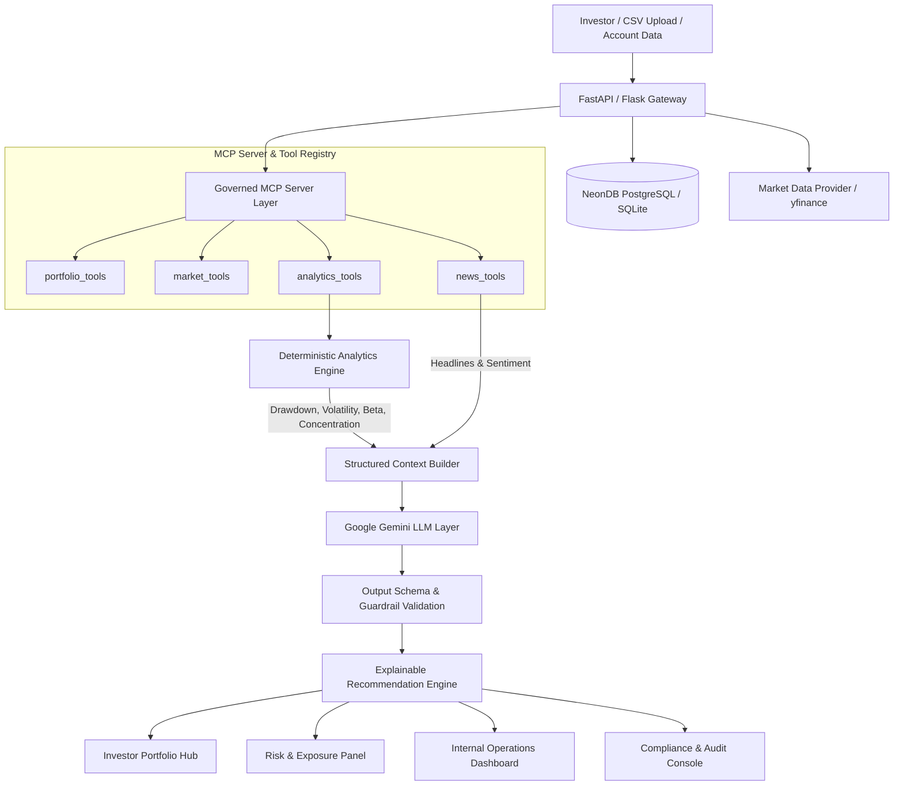

# Architecture Overview: Zerodha AI Financial Intelligence Platform

## 1. High-Level System Architecture

The Zerodha AI Financial Intelligence Platform is engineered as a **governed intelligence layer** that transforms raw portfolio holdings, live market quotes, news signals, and mathematical risk metrics into plain-language, explainable investor insights and reviewable recommendation cards.

---

## 2. Core Workflow Stages

1. **Portfolio Input & Ingestion**:
   - Parses Zerodha/Kite CSV & Excel formats.
   - Normalizes instrument symbols (`TCS` -> `TCS.NS`) and maps sectors.
   - Persists records into NeonDB PostgreSQL or local SQLite fallback.

2. **Governed MCP Server (`mcp_server/`)**:
   - Compliant with Model Context Protocol (v2025-06-18).
   - Typed schema definitions for portfolio lookups, market quotes, news sentiment, and risk analytics.
   - Enforces execution telemetry and audit logging.

3. **Deterministic Analytics Engine (`analytics/`)**:
   - Computes mathematical signals *before* LLM execution.
   - Calculates stock-level P&L contribution, sector concentration flags (>40%), historical maximum drawdown, annualized volatility, and benchmark Beta.

4. **AI Reasoning & Validation (`ai_workflows/`)**:
   - Gemini 1.5/3.5 Flash processes structured numeric context.
   - Strictly prevents hallucinations and unsupported buy/sell orders.
   - Generates 4 reviewable recommendation card categories (Risk Attention, Diversification Review, Catalyst Monitoring, Rebalancing Follow-up).

5. **Observability & Regulatory Governance**:
   - Cryptographic SHA-256 prompt hashing and model version logging.
   - Real-time internal operations telemetry (uptime, error rate, p50/p95 latency).
   - Compliance review console with officer sign-off workflows.
